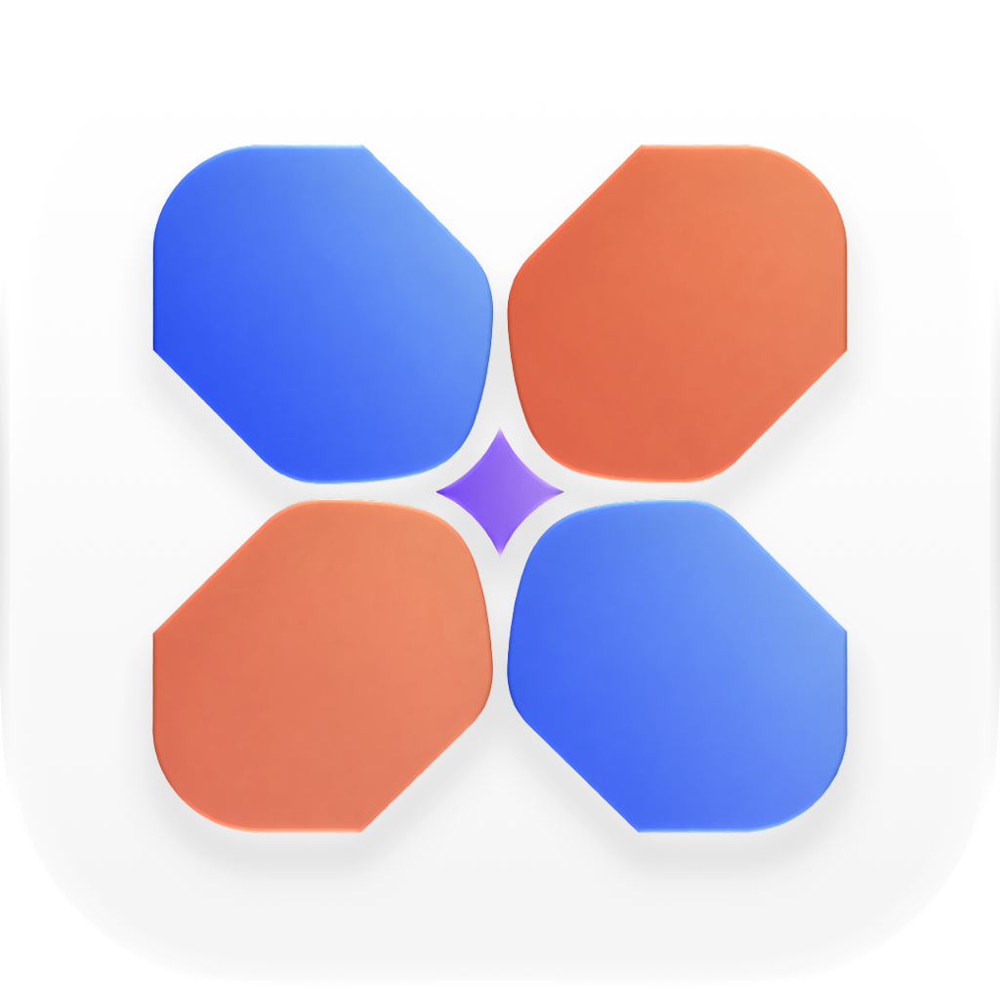

<p align="center">
  
</p>

<h1 align="center">AgentKib</h1>

<p align="center"><strong>让不同 Coding Agent 共享同一套可信的本地资产。</strong></p>

<p align="center">
  <a href="#简体中文">简体中文</a> · <a href="#english">English</a>
</p>

<p align="center">
  <a href="https://github.com/starroyhq/agentkib/actions/workflows/ci.yml"></a>
  <a href="https://github.com/starroyhq/agentkib/actions/workflows/windows-x64.yml"></a>
  <a href="https://github.com/starroyhq/agentkib/actions/workflows/linux.yml"></a>
  
  
</p>

> [!WARNING]
> AgentKib 仍处于开发预览阶段，本地数据格式和部分功能可能继续调整。目前尚未发布正式安装包，请从源码构建。

## 简体中文

AgentKib 是一个本地优先的 Coding Agent 资产中心。它自动发现你已经使用过的工作区，把散落在 Codex、Claude Code、Cursor、OpenClaw、Hermes 等工具中的 Instructions、Skills、MCP、记忆和配置集中展示，并在不同 Agent 之间安全地复用公共资产。

基础的发现、诊断和资产同步不需要账号、云端数据库或模型 API。**KIB** 代表 **Knowledge & Instruction Base（知识与指令底座）**。

### 为什么需要 AgentKib

同一个项目经常同时存在 `AGENTS.md`、`CLAUDE.md`、`.cursor/rules`、Skills 和多个 MCP 配置。它们的内容会逐渐重复、冲突或失效，而且每个 Agent 实际读取到的上下文并不相同。

AgentKib 提供一个统一入口来解决这些问题：

- **自动发现工作区**：从 Agent 的本地配置和历史元数据中发现仍然存在的项目，也支持添加扫描目录；不会默认扫描整块磁盘。
- **统一盘点资产**：按工作区、Agent 和类型查看 Instructions、Skills、MCP、Hooks、Profiles 与经审批的共享记忆。
- **预览有效上下文**：查看指定 Agent 在当前目录中的加载顺序、作用域、覆盖关系、可见 Skills 和潜在冲突。
- **诊断上下文健康**：通过 Context Doctor 检查 Instructions、Skills、MCP 的缺失、漂移、导入失败和精确重复，并为项目内问题生成可审查的修复方案。
- **交接 Codex 与 Claude Code 会话**：自动复用来源 Agent 的原生压缩上下文，脱敏后生成可编辑交接包；应用变更后可在目标 Agent 的全新空会话中继续。
- **安全同步公共资产**：先生成完整 Diff，再由用户确认写入；发现和浏览本身不会创建 manifest 或修改 Agent 配置。
- **集中连接 MCP**：通过本地 MCP Hub 管理下游 Server，并向支持的 Agent 提供统一入口。
- **只读浏览 Git**：查看复杂分支图、工作树、Commit 文件树和 Diff，并用已安装的 IDE、终端或文件管理器打开项目；不执行任何 Git 写操作。
- **查看额度与使用轨迹**：汇总可获得的滚动额度、重置时间、Token、会话、Git 提交、热力图和成就；不完整数据会明确标注。
- **后台常驻**：关闭主窗口后可继续在系统托盘运行。macOS 支持额度菜单栏面板，Windows 和 Linux 使用原生托盘菜单。

界面支持简体中文、繁體中文、日本語和 English，并提供浅色、深色与跟随系统三种主题。应用图标可在白底与黑底之间切换，默认使用白底；Windows 托盘使用彩色图形的透明底小图标。

### 支持的 Agent

| Agent | 当前支持 |
| --- | --- |
| Codex | 工作区发现、资产盘点、上下文预览、上下文诊断、公共资产同步、会话浏览与交接 |
| Claude Code | 工作区发现、资产盘点、上下文预览、上下文诊断、公共资产同步、会话浏览与交接 |
| Cursor | 工作区发现、资产盘点、上下文预览、上下文诊断和公共资产同步 |
| OpenClaw | 工作区发现、资产盘点、上下文预览、上下文诊断和公共资产同步 |
| Hermes | 工作区发现、资产盘点、上下文预览、上下文诊断和公共资产同步 |
| DeepSeek Harness | **Beta，只读**：工作区发现、资产盘点、上下文预览、上下文诊断和累计 Token |

AgentKib 会区分“已安装”和“只发现了卸载后的本地数据”。涉及 Agent Home 的写入会单独请求授权；DeepSeek Harness 的存储协议仍处于 Beta，因此不会被写入或配置 MCP。

### 使用流程

1. 启动 AgentKib，等待它自动发现本机已有工作区。
2. 在“工作区”“资产”和“Agent”中检查现有配置。
3. 打开工作区的“诊断”，检查各 Agent 的 Instructions、Skills 与 MCP 状态。
4. 在“指令上下文”中预览某个 Agent 在指定目录中实际可见的上下文。
5. 在 Codex 或 Claude Code 会话详情中创建交接，预览脱敏内容后保存，或应用并打开目标 Agent。
6. 需要统一规则时，编辑共享 Instructions、Skills 或 MCP。
7. 审查 ChangeSet 的完整 Diff，确认后再写入项目或 Agent Home。

工作区不需要预先存在 `.agentkib/manifest.yaml`。只有首次保存共享资产时，AgentKib 才会把 manifest 纳入待确认的 ChangeSet。

### 本地与隐私边界

- 不需要登录，不提供 AgentKib 云同步；发现、诊断和普通交接不会调用模型或上传项目资产。
- 自动发现只保存路径、来源、数量和时间等聚合元数据，不保存 Prompt、消息正文、对话标题或原始 Session ID。
- 创建交接时会按需读取本地会话记录，排除工具与推理内容并遮盖敏感值；正文不写入 SQLite、日志或审计详情。
- 用户确认保存后，交接正文写入项目的 `.agentkib/handoffs/`，该目录默认加入 `.gitignore`，但仍应在 ChangeSet 中检查完整 Diff。
- 只有交接内容超过安全上限且用户明确确认时，才会把脱敏内容交给本机来源 Agent CLI 总结；这可能调用模型并消耗额度。
- 凭据、Cookie、Token、`.env`、私钥和消息数据库不会进入资产目录或日志。
- Git 统计不保存提交说明、Diff、文件内容或明文邮箱。
- 额度快照只保存在本机；外部 Collector 的原始输出不会落库。
- Agent 提议的记忆只有在用户批准后才会被其他 Agent 检索。
- 所有文件写入都经过路径边界、原始哈希、Diff、备份和写后验证。

可选的 Obsidian、OpenClaw Remote Gateway 和 Hermes Remote Gateway 集成均需主动配置，并保持各自的权限边界。

### 平台状态

| 平台 | 状态 |
| --- | --- |
| macOS 13.3+（Apple Silicon / Intel） | 主要开发与验收平台 |
| Windows 11 x64（WebView2 111+） | PR 验证 Rust 平台代码；手动工作流构建并烟测 NSIS |
| Ubuntu 22.04 x64（WebKitGTK 2.40+） | 核心 CI 平台；手动工作流构建并验证 `.deb` 与 AppImage |
| Fedora x64 | PR 验证 Rust 平台代码；手动工作流构建并验证 `.rpm` |
| Windows ARM64 / Linux ARM64 | Preview；PR 验证核心编译或测试，手动工作流生成预览包 |

Windows 11 x64 的完整环境安装、开发启动、NSIS 打包和使用步骤见 [Windows 构建、安装与使用指南](docs/WINDOWS.md)。

### 从源码运行

需要 Rust stable、Node.js 和 pnpm 10。桌面端还需要对应平台的 [Tauri 2 系统依赖](https://v2.tauri.app/start/prerequisites/)：macOS 13.3+ 使用 Xcode Command Line Tools，Windows 11 使用 Visual Studio Build Tools 2022、Windows SDK 与 WebView2 111+，Linux 使用 GTK 3、WebKitGTK 4.1（运行时 2.40+）、AppIndicator、librsvg 和 libxdo。旧版 WebView 无法运行 Tailwind CSS v4 生成的界面。

```bash
pnpm install
pnpm dev
```

构建桌面安装包：

```bash
pnpm tauri build
```

Linux 可先运行只读环境诊断，再使用项目脚本生成发行包：

```bash
apps/desktop/scripts/diagnose-linux.sh
apps/desktop/scripts/build-linux-bundles.sh
```

首次构建可能下载并校验固定版本的额度 Collector。构建产物位于 `target/release/bundle/`，第三方许可见 [THIRD_PARTY_NOTICES.md](THIRD_PARTY_NOTICES.md)。

### 验证

```bash
cargo fmt --all -- --check
cargo test --workspace
cargo clippy --workspace --all-targets -- -D warnings
pnpm test
pnpm typecheck
pnpm build
```

问题反馈请前往 [GitHub Issues](https://github.com/starroyhq/agentkib/issues)。正式预览版本将发布在 [Releases](https://github.com/starroyhq/agentkib/releases)。

---

## English

AgentKib is a local-first asset center for people who use multiple coding agents. It discovers existing workspaces, inventories instructions, Skills, MCP connections, memory, and native configuration, and helps reuse shared assets safely across agents. Core discovery, diagnostics, and asset synchronization do not require an account, cloud database, or model API.

**KIB** stands for **Knowledge & Instruction Base**.

### What it does

- Discovers existing workspaces from supported agents and explicitly added scan folders without scanning the entire disk.
- Catalogs instructions, Skills, MCP connections, hooks, profiles, configuration, and approved memory across workspaces.
- Previews the effective context for an agent and working directory, including load order, scope, overrides, visible Skills, and conflicts.
- Diagnoses missing, drifted, unreadable, or exactly duplicated Instructions, Skills, and MCP configuration, then prepares reviewable project-scoped repairs.
- Hands Codex and Claude Code sessions across agents by reusing native compacted context, redacting sensitive values, and optionally opening a fresh target-agent session after the handoff is applied.
- Generates a complete ChangeSet and diff before writing shared assets or native agent configuration.
- Runs a local MCP Hub that provides a single entry point to downstream MCP servers.
- Browses complex Git history, working-tree changes, commit file trees, and diffs without modifying the repository, and opens projects in verified installed apps.
- Shows available rolling quota windows, Token usage, sessions, Git activity, contribution heatmaps, streaks, and achievements.
- Continues working from the system tray after the main window is hidden.

AgentKib supports light, dark, and system appearance, with Simplified Chinese, Traditional Chinese, Japanese, and English UI. The app icon can use a white or black background (white by default), while the Windows tray uses a compact transparent version of the colored mark.

### Supported agents

Codex, Claude Code, Cursor, OpenClaw, and Hermes support discovery, asset inventory, context preview, context diagnostics, and shared-asset synchronization. Codex and Claude Code additionally support session browsing and handoff. **DeepSeek Harness is currently Beta and read-only**, with workspace discovery, asset inventory, context preview, context diagnostics, and cumulative Token coverage.

AgentKib distinguishes an installed app or CLI from leftover local data. Agent Home writes require separate approval, and DeepSeek Harness is never selected as a write target while its storage contracts remain in Beta.

### Local and private by default

- No login or AgentKib cloud sync is required. Discovery, diagnostics, and ordinary handoffs do not invoke a model or upload project assets.
- Discovery stores aggregate metadata, not prompts, message bodies, conversation titles, or raw session IDs.
- Creating a handoff reads the local transcript on demand, excludes tool and reasoning records, and redacts sensitive values without storing the body in SQLite, logs, or audit details.
- Approved handoffs are written to `.agentkib/handoffs/` inside the project and ignored by Git by default; the complete ChangeSet should still be reviewed before applying it.
- Only when a handoff exceeds the safety limit and the user explicitly confirms does AgentKib send redacted content to the local source-agent CLI for summarization, which may invoke a model and consume quota.
- Credentials, cookies, tokens, environment files, private keys, and message databases are excluded from the catalog and logs.
- Git analytics do not store commit subjects, diffs, file contents, or plaintext email addresses.
- Agent-proposed memory is not shared until you approve it.
- Every generated file change is checked, previewed as a diff, backed up, and validated after writing.

Optional Obsidian and OpenClaw/Hermes Remote Gateway integrations must be configured explicitly and retain their own permission boundaries.

### Build from source

Install Rust stable, Node.js, pnpm 10, and the [Tauri 2 prerequisites](https://v2.tauri.app/start/prerequisites/) for your platform.

```bash
pnpm install
pnpm dev
```

Build the desktop app with:

```bash
pnpm tauri build
```

Linux users can diagnose the local environment and build packages with:

```bash
apps/desktop/scripts/diagnose-linux.sh
apps/desktop/scripts/build-linux-bundles.sh
```

Build output is written to `target/release/bundle/`. Third-party licenses are listed in [THIRD_PARTY_NOTICES.md](THIRD_PARTY_NOTICES.md).

Maintainers can generate unsigned multi-platform preview packages with the manually triggered GitHub Actions workflow described in [docs/RELEASE.md](docs/RELEASE.md). Pull requests and pushes run platform checks without producing installers.

### Validate

```bash
cargo fmt --all -- --check
cargo test --workspace
cargo clippy --workspace --all-targets -- -D warnings
pnpm test
pnpm typecheck
pnpm build
```

AgentKib is a development preview. There are no official downloads yet; future preview builds will be published on [Releases](https://github.com/starroyhq/agentkib/releases). For feedback, use [GitHub Issues](https://github.com/starroyhq/agentkib/issues).
