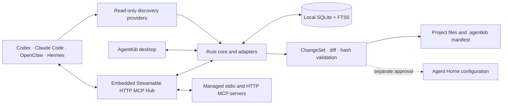

<p align="center">
  
</p>

<h1 align="center">AgentKib</h1>

<p align="center"><strong>The local Knowledge &amp; Instruction Base for every agent.</strong></p>

<p align="center">
  <a href="#english">English</a> · <a href="#简体中文">简体中文</a>
</p>

<p align="center">
  
  
  
</p>

<p align="center">
  <a href="https://github.com/starroyhq/agentkib/releases">Releases</a> ·
  <a href="#build-from-source">Build from source</a> ·
  <a href="#features">Features</a>
</p>

> [!WARNING]
> AgentKib is a development preview. The repository does not have an official prebuilt release yet, and current acceptance work is macOS-first. Build from source if you want to try it today.

## English

AgentKib is a local-first, Git-native control plane for agent assets. **KIB** stands for **Knowledge & Instruction Base**.

Coding agents usually keep their project instructions, Skills, MCP connections, histories, and reusable knowledge in different formats and locations. AgentKib discovers those workspaces, catalogs what already exists, and lets Codex, Claude Code, OpenClaw, and Hermes work from one governed source of truth—without introducing an account, cloud database, or model API.

The core workflow is deliberately reviewable:

1. **Discover** workspaces from agent configuration and local session metadata.
2. **Catalog** instructions, Skills, MCP connections, hooks, profiles, and approved memories.
3. **Preview** the effective context for an agent and working directory.
4. **Review** every proposed file change as a ChangeSet and full diff.
5. **Apply** only after hash validation and explicit approval.

### Features

- **Global workspace discovery** — aggregates existing workspaces from all supported agents and from scan roots you explicitly authorize. It does not crawl your whole disk.
- **Obsidian workspace links** — detects the local Obsidian app and known Vaults, then opens an explicitly linked Vault path from a workspace. It does not read note contents or modify Vault files.
- **Cross-workspace asset catalog** — searches project and Agent Home metadata for instructions, Skills, MCP, hooks, profiles, configurations, and memory ownership.
- **Git-native shared assets** — `.agentkib/manifest.yaml` is the versionable source of truth for shared instructions, scoped rules, Skills, connections, memory policy, and adapter state.
- **Effective context preview** — shows load order, source files, directory inheritance, platform overrides, visible Skills/connections/memories, and warnings without pretending to expose a model's hidden system prompt.
- **Safe generation** — every generated configuration write goes through a ChangeSet with a full diff, original-file hashes, atomic replacement, validation, and local backups. OpenClaw and Hermes Home changes require separate approval.
- **Governed shared memory** — agents may propose memory through MCP, but only user-approved records are searchable by other agents.
- **Unified MCP Hub** — every Agent connects to one local Streamable HTTP endpoint while AgentKib lazily starts and reuses downstream stdio or HTTP servers.
- **Local insights and achievements** — aggregates available Token/session metadata and Git activity into agent breakdowns, a 52-week contribution heatmap, streaks, and milestone badges.
- **macOS background lifecycle** — the menu-bar app refreshes discovery and insights every 15 minutes; hiding the window removes the Dock icon without stopping the process.

### Supported agents

| Agent | Project instructions | Skills | MCP / integration |
| --- | --- | --- | --- |
| Codex | `AGENTS.md`, `AGENTS.override.md` | `.agents/skills` | `.codex/config.toml` |
| Claude Code | thin `CLAUDE.md` importing `@AGENTS.md` | `.claude/skills` | `.mcp.json` |
| OpenClaw | `AGENTS.md`, optional `TOOLS.md` override | `.agents/skills` | authorized merge into OpenClaw Home config |
| Hermes | `AGENTS.md`, optional `.hermes.md` override | `.agents/skills` | authorized merge into Hermes Home config |

Existing native agents/profiles, hooks, and private-memory assets are cataloged read-only; AgentKib does not redistribute them across platforms in this preview.

### How it fits together



### Privacy and boundaries

AgentKib is designed to keep governance local and metadata-minimal:

- No account, cloud service, subscription, model API, or remote database is required.
- Automatic discovery stores workspace paths, agent/evidence type, aggregate session counts, and timestamps—not session IDs, titles, prompts, or message bodies.
- Obsidian integration reads only the app location and Vault registry paths. Workspace links stay in AgentKib's local data directory; Vault contents are not indexed.
- Agent Home inventory excludes credentials, `.env` files, tokens, private keys, message databases, and telemetry directories.
- Git insights do not store commit subjects, diffs, file contents, or plaintext email addresses. Author identities are matched using local hashes.
- Memory is shared only after approval. MCP cannot approve memory, force configuration writes, disable permissions, or read secrets.
- Token coverage depends on what each agent has preserved locally. The UI labels values as **exact**, **estimated**, or **incomplete** instead of presenting partial data as a precise total.
- “Agent-attributed commits” are a separate direct-or-estimated association signal; AgentKib does not label them as “AI-written commits.”

### Install

The [Releases page](https://github.com/starroyhq/agentkib/releases) is reserved for future preview builds. There is no official downloadable build at the moment.

To try AgentKib now, build it from source using the shared [development instructions](#build-from-source) below.

### First run

1. Launch AgentKib; the global Home opens immediately while discovery runs in the background.
2. Review automatically discovered workspaces, or add an authorized scan root/manual workspace.
3. Open a workspace to inspect assets and effective context, then prepare its manifest and adapter changes.
4. Review the complete diff and approve the ChangeSet; Agent Home changes require a separate confirmation.

---

## 简体中文

AgentKib 是一个本地优先、Git 原生的 Agent 资产控制台。**KIB** 代表 **Knowledge & Instruction Base（知识与指令底座）**。

不同编码 Agent 往往用不同格式、不同路径保存项目指令、Skills、MCP 连接、历史记录和可复用知识。AgentKib 会发现这些工作区、盘点已有资产，并让 Codex、Claude Code、OpenClaw 与 Hermes 围绕一套受治理的公共资产工作，而不引入账号、云端数据库或模型 API。

核心流程保持透明、可审查：

1. **发现**：从 Agent 配置和本地会话元数据发现工作区。
2. **盘点**：统一索引指令、Skills、MCP、Hooks、Profiles 和已批准记忆。
3. **预览**：查看指定 Agent 在某个工作目录中获得的有效上下文。
4. **审查**：所有文件修改先生成 ChangeSet 和完整 Diff。
5. **应用**：通过文件哈希检查并获得明确确认后才写入。

### 核心能力

- **全局工作区发现**：聚合四类 Agent 已使用的工作区，并补充用户明确授权的扫描目录；不会扫描整块磁盘。
- **Obsidian 工作区联动**：检测本机 Obsidian 和已知 Vault，将工作区显式关联到 Vault 路径并一键打开；不读取笔记正文，也不修改 Vault 文件。
- **跨工作区资产目录**：检索项目和 Agent Home 中的指令、Skills、MCP、Hooks、Profiles、配置及记忆归属元数据。
- **Git 原生公共资产**：`.agentkib/manifest.yaml` 是可进入版本控制的真相源，统一描述共享指令、目录规则、Skills、连接、记忆策略和适配器状态。
- **有效上下文预览**：展示加载顺序、来源文件、目录继承、平台覆盖、可见 Skills/连接/记忆及警告，不伪造模型内部系统提示词。
- **安全生成配置**：所有生成配置写入均经过完整 Diff、原始文件哈希、原子替换、写后验证和本地备份；OpenClaw/Hermes Home 修改需要单独授权。
- **受治理的共享记忆**：Agent 可以通过 MCP 提交记忆提议，但只有用户批准后的记录才能被其他 Agent 检索。
- **统一 MCP Hub**：所有 Agent 只连接一个本地 Streamable HTTP 入口；AgentKib 按需启动并复用下游 stdio 或 HTTP Server。
- **本地统计与成就**：汇总可获得的 Token、会话和 Git 活动，提供 Agent 占比、近 52 周贡献热力图、连续活跃与里程碑徽章。
- **macOS 后台常驻**：菜单栏应用每 15 分钟刷新发现和统计；隐藏窗口后 Dock 图标消失，但后台进程继续运行。

### 支持的 Agent

| Agent | 项目指令 | Skills | MCP / 接入方式 |
| --- | --- | --- | --- |
| Codex | `AGENTS.md`、`AGENTS.override.md` | `.agents/skills` | `.codex/config.toml` |
| Claude Code | 导入 `@AGENTS.md` 的薄 `CLAUDE.md` | `.claude/skills` | `.mcp.json` |
| OpenClaw | `AGENTS.md`、可选 `TOOLS.md` 平台覆盖 | `.agents/skills` | 经授权合并 OpenClaw Home 配置 |
| Hermes | `AGENTS.md`、可选 `.hermes.md` 平台覆盖 | `.agents/skills` | 经授权合并 Hermes Home 配置 |

现有原生 Agents/Profiles、Hooks 和私有 Memory 资产只做只读盘点；当前预览版不会将它们跨平台分发。

### 系统关系

上方 [How it fits together](#how-it-fits-together) 的架构图展示了桌面端、Rust Core、SQLite、ChangeSet、项目文件、Agent Home、统一 MCP Hub 与托管下游 Server 之间的关系。

### 隐私与边界

AgentKib 坚持本地治理和最小化元数据：

- 不需要账号、云服务、订阅、模型 API 或远程数据库。
- 自动发现只保存工作区路径、Agent/证据类型、聚合会话数量和时间，不保存会话 ID、标题、Prompt 或消息正文。
- Obsidian 联动只读取 App 位置和 Vault 注册路径；工作区关联保存在 AgentKib 本地数据目录，不索引 Vault 内容。
- Agent Home 盘点明确排除凭据、`.env`、Token、私钥、消息数据库和遥测目录。
- Git 统计不保存提交说明、Diff、文件内容或明文邮箱；作者身份通过本地哈希匹配。
- 记忆只有在批准后才会共享；MCP 不能直接批准记忆、强制写配置、关闭权限或读取密钥。
- Token 覆盖范围取决于各 Agent 在本地保留的数据。界面会明确标注“精确 / 估算 / 数据不完整”，不会把部分数据伪装成精确总量。
- “Agent 关联提交”只是单独的直接或估算关联信号，不会被命名为“AI 编写提交”。

### 安装

[Releases 页面](https://github.com/starroyhq/agentkib/releases)用于后续发布预览构建。目前还没有正式可下载版本。

现在体验 AgentKib，请按照下方共用的[源码构建说明](#build-from-source)操作。

### 首次使用

1. 启动 AgentKib；应用会直接进入全局 Home，并在后台执行工作区发现。
2. 检查自动发现的工作区，或添加授权扫描目录/手动工作区。
3. 进入工作区查看资产和有效上下文，然后准备 manifest 与适配器修改。
4. 审查完整 Diff 并确认 ChangeSet；Agent Home 修改还需要二次确认。

---

## Build from source

_从源码构建_

### Requirements / 环境要求

- macOS (current acceptance platform / 当前验收平台)
- Xcode Command Line Tools
- Rust stable toolchain
- Node.js
- pnpm 10 (`packageManager` is pinned to `pnpm@10.8.1`)

### Run the desktop app / 运行桌面应用

```bash
pnpm install
pnpm dev
```

The MCP Hub is embedded in the Tauri process and starts with the desktop app. The first Rust build may take longer.

MCP Hub 嵌入 Tauri 进程并随桌面应用启动；首次 Rust 编译可能需要较长时间。

### Build an application bundle / 构建应用安装包

```bash
pnpm tauri build
```

### Validate the workspace / 验证工作区

```bash
cargo fmt --all -- --check
cargo test --workspace
cargo clippy --workspace --all-targets -- -D warnings
pnpm test
pnpm build
pnpm tauri build
```

## CLI

The CLI emits JSON/YAML for inspection and automation. It does not apply a planned ChangeSet.

CLI 输出 JSON/YAML，适合检查和自动化；`plan` 只生成 ChangeSet，不会直接应用写入。

```bash
cargo run -p agentkib-cli -- scan /path/to/project
cargo run -p agentkib-cli -- context /path/to/project codex
cargo run -p agentkib-cli -- plan /path/to/project
cargo run -p agentkib-cli -- validate /path/to/project
cargo run -p agentkib-cli -- manifest /path/to/project
```

## MCP tools / MCP 工具

The desktop app listens on `127.0.0.1:47653` by default. Reviewed ChangeSets configure Codex, Claude Code, OpenClaw, and Hermes to connect to the workspace-and-Agent-specific Streamable HTTP URL. Third-party tools use the `{server}__{tool}` namespace.

Downstream servers are merged from global and project `mcp.json` / `mcp.local.json` layers. The Hub can install pinned npm or PyPI packages from the official Registry, connect to remote Streamable HTTP servers, and complete MCP OAuth in the system browser. Local files hold environment values, headers, and OAuth credentials with mode `0600`; those values are masked in the UI and never stored in SQLite.

桌面应用默认监听 `127.0.0.1:47653`。经审查的 ChangeSet 会让 Codex、Claude Code、OpenClaw 与 Hermes 连接包含工作区和 Agent 身份的 Streamable HTTP URL；第三方工具使用 `{server}__{tool}` 命名空间。

下游 Server 配置由全局和项目级 `mcp.json` / `mcp.local.json` 四层合并。Hub 可从官方 Registry 安装固定版本的 npm 或 PyPI 包、连接远程 Streamable HTTP Server，并在系统浏览器中完成 MCP OAuth。环境变量、Header 和 OAuth 凭据只写入权限为 `0600` 的本地配置，在界面中始终脱敏，也不会进入 SQLite。

| Tool | Purpose / 用途 |
| --- | --- |
| `workspace_get_context` | Resolve effective context for an agent and working directory / 解析 Agent 与工作目录的有效上下文 |
| `asset_list` | List scanned project assets / 列出已扫描的项目资产 |
| `asset_get` | Read one allowed text asset / 读取一项允许访问的文本资产 |
| `skill_list` | List shared Skills / 列出公共 Skills |
| `memory_search` | Search approved shared memory / 搜索已批准的共享记忆 |
| `memory_propose` | Submit a memory proposal for review / 提交待审批记忆提议 |

## Manifest example / Manifest 示例

```yaml
schema_version: 2
workspace:
  id: your-project-id
  name: your-project
instructions:
  shared: |
    # Project rules
  scoped:
    - path: packages/api
      content: Use the API package conventions.
  platform_overrides: {}
skills: []
mcp:
  config: mcp.json
memories:
  require_approval: true
adapters:
  codex: { enabled: true, generated_hashes: {} }
  claude-code: { enabled: true, generated_hashes: {} }
  open-claw: { enabled: true, generated_hashes: {} }
  hermes: { enabled: true, generated_hashes: {} }
```

Skills are synchronized as complete UTF-8 text directories, including files under `references/` and `scripts/`. Binary Skill assets are rejected explicitly in this preview rather than silently omitted.

Skills 会以完整 UTF-8 文本目录同步，包括 `references/`、`scripts/` 等子目录。当前预览版会明确拒绝二进制 Skill 资产，不会静默遗漏。

## Project status / 项目状态

- Development preview; interfaces and local data schemas may still change before the first release. / 当前处于开发预览阶段，首次发布前接口和本地数据结构仍可能变化。
- macOS is the current acceptance target; the Rust core avoids macOS-specific path assumptions where possible. / macOS 是当前验收目标；Rust Core 会尽量避免绑定 macOS 路径语义。
- Issues and focused pull requests are welcome while the project is taking shape. / 欢迎通过 Issue 和聚焦的小型 Pull Request 参与项目完善。
